# Build Plan — Vulcan OmniPro 220 Multimodal Agent

Multimodal agent on the **Claude Agent SDK**. Corpus is tiny (51 pages), so we **stuff the whole
manual into context (cached)** instead of building retrieval — perfect recall, no retrieval-miss.
Graded centerpiece: **multimodal responses** (manual images, SVG diagrams, interactive artifacts).

## Key decisions
- **Stuffing > RAG at 51 pages.** Text ≈ 45K tokens of a 1M window; cache once (~$0.75), then ~$0.06/query. No embeddings, no index, no vocabulary-mismatch risk. Retrieval is a *documented scale path*, not built.
- **Stack: TypeScript + Next.js.** One repo for SDK backend + React artifact rendering. `@anthropic-ai/claude-agent-sdk`, model `claude-opus-5`.
- **Hosting: long-running Node service** (Render/Railway/Fly). The Agent SDK spawns the Claude Code runtime — **not** edge/serverless. Verify in Phase 1.

## Architecture

```mermaid
flowchart LR
  subgraph Offline["Ingest once (commit output)"]
    PDFs[files/*.pdf] --> V[Claude vision:<br/>text+tables+figure descriptions]
    V --> MD[(kb/pages/*.md + images/*.png)] --> B[kb/manual.md = stuffed doc]
  end
  subgraph Runtime["Node process (Agent SDK)"]
    UI[Next.js chat] -- SSE --> Q["query&#40;&#41;<br/>systemPrompt = persona + manual.md (CACHED)"]
    Q --> T[multimodal tools:<br/>get_page_image · show_manual_image · render_diagram · render_artifact]
  end
  B -.into system prompt.-> Q
  T -- rendered parts --> UI
```

No `search_manual`/grep/index at runtime — the manual is already in context. Tools are for *multimodal*, not finding text.

## Phases

**1. Spike (½ day).** Scaffold Next.js+TS. Prove: (a) `query()` streamed over SSE, (b) a tool returning an `image` block the model sees, (c) `cache_read_input_tokens > 0` on turn 2 (validates stuffing). Lock hosting.

**2. Extraction → stuffed bundle.** `scripts/ingest.ts`, run once, commit. **Detailed design + runbook: [docs/EXTRACTION.md](docs/EXTRACTION.md).**
- PDF → per-page PNG (local) → Claude vision → `kb/pages/*.md` (verbatim text, tables as markdown, **every figure described**).
- Concatenate → `kb/manual.md` (deterministic: sorted, no timestamps — else cache breaks) + `kb/manifest.json`.
- Stuff **all text** always; stuff **only high-value images** (selection chart, wiring schematic, weld-diagnosis, front panel); serve the rest via `get_page_image`.

**3. Agent.** `query()` with `systemPrompt` = persona + `manual.md` + curated images (auto-cached); `allowedTools` = multimodal tools only; sessions for multi-turn. Tools (`tool()`+`createSdkMcpServer`, return `structuredContent` for the UI):
- `get_page_image` → image block (model looks at a specific figure).
- `show_manual_image` → inline image + citation.
- `render_diagram` → SVG (polarity/cable routing).
- `render_artifact` → interactive HTML/React (duty-cycle calc, troubleshooting flow, settings configurator).
- System prompt: garage-beginner tone; cite pages; **show/draw for visual Qs, generate artifacts for calc/decision Qs**; ask one clarifying question when ambiguous.

**4. Multimodal renderer (centerpiece).** UI assembles ordered parts: `text·manual_image·diagram·artifact`. Artifacts run in a **sandboxed `<iframe srcdoc>`** with Babel-standalone + React via CDN, `postMessage` for auto-height/errors (reverse-engineered Claude artifacts). Use tested templates to avoid broken generated code.

**5. Frontend.** Clean chat: streaming, inline cited images, diagrams, embedded artifacts, starter prompts (the 3 README questions). Stretch: voice in/out.

**6. Eval + hardening.** ~15–20 golden Q&A (duty-cycle cross-voltage, polarity per process, porosity, selection-chart reads, ambiguous → clarify, not-in-manual → refuse); assert correctness **and** modality. Verify cache hits; sanitize SVG/artifacts; sandbox iframe; no runtime file writes.

**7. Package.** README leading with the **stuffing-vs-RAG rationale** + extraction + multimodal contract + scale path. 2-min setup (`cp .env.example .env` → `npm install` → `npm run dev`; `kb/` committed). Host + link. Video walkthrough.

## Top risks
- **Silent cache miss** (prefix byte-changed) → keep `manual.md` deterministic; verify in Phase 1 & 6.
- **Agent SDK on serverless** → spike hosting first; default long-running Node.
- **Broken artifact code** → tested templates + iframe error capture + retry.
- **Extraction misses image-only data** → "describe every figure" prompt + curated stuffed images + `get_page_image`.

## Scale path (documented, not built)
Past the context window, swap stuffing for retrieval without touching extraction: MiniSearch/BM25 (optionally a local-model vector index) over `kb/pages/*.md` + a `search_manual` tool. Shows the design scales to Prox's full catalog.
```
